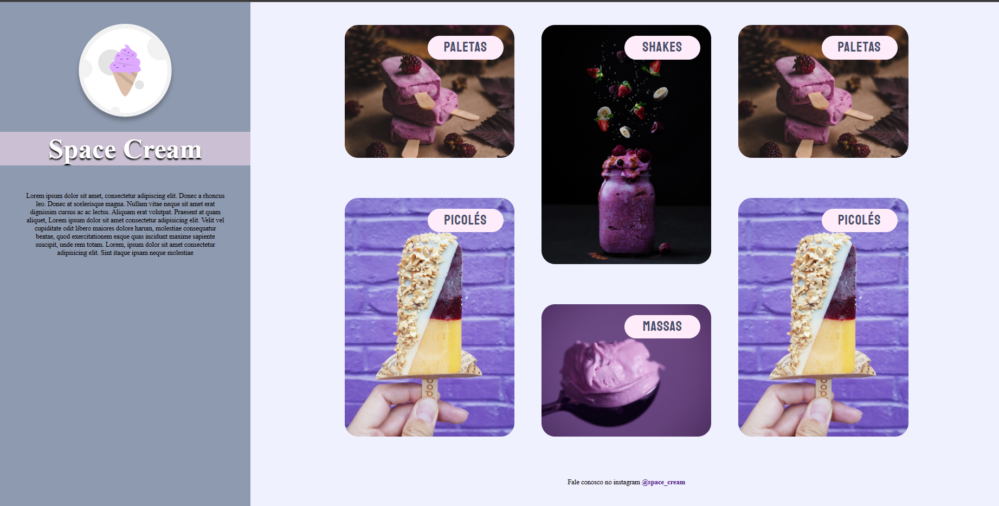
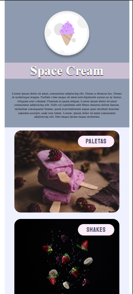

## desafio do stage 06 Space Cream 

neste desafio eu aprendi como usar grid, deixar mais responsivo e usar animação.

# desktop

# mobile

## Funcionalidades

- Grid;
- Animações e transições;
- Media queries.
